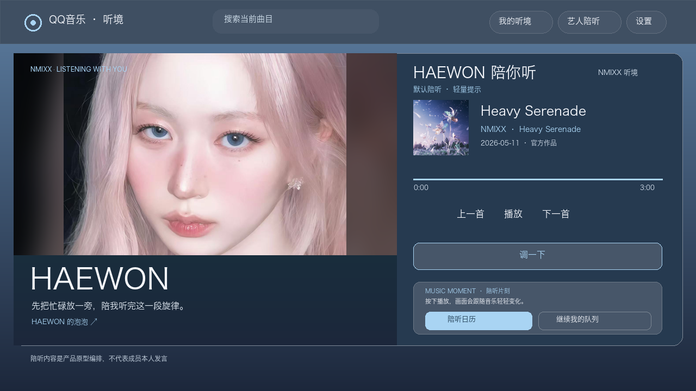

# QQ音乐·听境

**让音乐始终站在主页面，AI 只在需要时调整听歌环境。**

「听境」是 QQ 音乐工作场景的 AI 黑客松概念原型。平时只有一个简洁的主播放页；选择艺人或组合后，进入全屏陪听空间。创建、保存和主题设置通过侧边弹层完成。

▶ [打开在线演示](https://music-multiverse-hackathon-2026.workspace-012770.chatgpt.site/)（当前仅项目所有者可访问） · [观看交互流程示意视频](dist/assets/tingjing-demo.mp4)



[查看安静模式](dist/assets/quiet-preview.png) · [查看深度模式](dist/assets/deep-preview.png) · [查看 NMIXX 组合模式](dist/assets/group-preview.png)

## 这版重点

| 需求 | 已实现的交互 |
| --- | --- |
| 听歌时页面更简单 | 主页面只突出封面、歌曲、播放与当前听境；待播列表和详情默认收起，可一键展开 |
| 主题跟随用户 | 工作蓝、经典绿、会员黑金，以及自定义强调色；选择会保存在浏览器 |
| 曲目不再是虚构数据 | 展示 NMIXX 真实曲目、官方作品封面、专辑和发行日期，并提供来源链接 |
| 全屏、可选的沉浸陪听 | 从六位成员或 NMIXX 组合中选择；均使用用户提供的照片和不同的演示邀请语。当前听境保留，歌曲、进度、视觉同屏；电脑横屏与手机竖屏分别适配 |
| 陪伴有分寸 | 底部合并为紧凑信息条，仅保留「陪听日历」和「继续我的队列」；安静模式收敛光效与资料、默认模式保留轻量提示、深度模式展开当前歌曲的作品线索；切换即生效并记住选择，真实播放时长按日期记录在本机 |
| 小小的个人入口 | 「泡泡」演示链接只出现在所选成员或组合的陪听空间，随选择更新；点击会说明尚未接入，避免误以为已联通服务 |
| 播放状态看得见 | 点击播放会立即出现连接中状态；实际开始后变为暂停图标，失败或超时会恢复播放图标并提示官方入口。视频使用 NMIXX 官方 YouTube 嵌入播放器 |
| 听境可以调整 | 一句话生成配置；「不对味」纠偏与「就这个感觉」强化偏好都收进「调一下」，并可保存为听境 |

## 60 秒演示

1. 打开主页面，点 **待播列表** 展开，再收起；点 **NMIXX 听境 · 详情** 查看精简后的听境面板。
2. 点 **艺人陪听**，选 **HAEWON** 进入全屏空间；在照片旁看她的泡泡演示入口，切换 **安静／默认／深度** 比较画面和作品信息；再点 **换成员**，选择 **NMIXX 组合** 看合照模式与对应入口。
3. 点播放看连接状态；如网络可用，官方视频和进度会同步。点 **陪听日历** 看实际播放时间如何按日期累积。
4. 点 **继续我的队列** 接着听，或点 **调一下** 微调偏好；回主页面切换主题颜色。

## 运行

这是零依赖静态网页。Mac 可双击 `start-demo.command`；其他系统在本目录运行：

```bash
python3 run_demo.py
```

页面本身、听境配置、主题切换、成员照片和主要专辑封面可离线使用。**官方视频需要联网**；能否嵌入取决于地区和网络，页面提供原站链接作为后备入口。陪听日历只在官方视频实际播放且陪听页打开时计时，数据保存在当前浏览器；日历内的「预览样例记录」不会写入实际数据。《Kiss (Instrumental)》的官方频道缩略图也需联网加载。

## 数据来源与原型边界

- 艺人成员和作品说明：[JYP Entertainment 官方艺人页](https://nmixx.jype.com/profile)、[官方作品目录](https://nmixx.jype.com/discography)。七张陪听照片（六位成员及组合）由项目用户提供；主要封面取自 JYP 官方作品图，并压缩后放入演示包；Kiss (Instrumental) 使用[官方艺人频道视频](https://www.youtube.com/watch?v=75ZD27EsyLk)缩略图。
- 播放由 JYP / NMIXX 官方 YouTube 视频嵌入提供；本站不下载、不托管歌曲音频。
- 推荐分值、自然语言解析、陪听时刻和听境保存仍是本地原型逻辑；没有接入 QQ 音乐账号、正式曲库、远程大模型、泡泡或实时好友同步。陪听视觉不是艺人实时在线，邀请语为演示文案，互动文案与选歌也不代表艺人本人发言、推荐或官方合作。

产品原则：**Music First · AI Executes, Not Talks · Context Is Persistent**。
